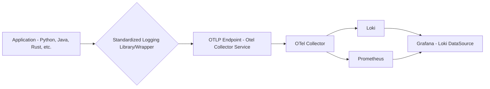

# Zenoh Monitoring with K3s, OpenTelemetry, Loki, Prometheus, and Grafana

This repository contains Kubernetes YAML files for deploying a comprehensive monitoring stack for Zenoh-based applications on a K3s cluster.

## Prerequisites

* A running K3s cluster.
* `kubectl` configured to connect to your K3s cluster.
* (Optional) An Ingress controller (like Nginx Ingress) if you want to expose Grafana externally.

## Deployment

1.  **Clone the repository:**

    ```bash
    git clone <repository_url>
    cd zenoh-monitoring
    ```

2.  **Create the `zenoh-monitoring` namespace:**

    ```bash
    kubectl create namespace zenoh-monitoring
    ```

3.  **Deploy the components:**

    ```bash
    kubectl apply -f grafana/grafana-config.yaml -n zenoh-monitoring
    kubectl apply -f grafana/grafana-deployment.yaml -n zenoh-monitoring
    kubectl apply -f grafana/grafana-service.yaml -n zenoh-monitoring

    kubectl apply -f loki/loki-config.yaml -n zenoh-monitoring
    kubectl apply -f loki/loki-deployment.yaml -n zenoh-monitoring
    kubectl apply -f loki/loki-service.yaml -n zenoh-monitoring

    kubectl apply -f otel-collector/otel-collector-config.yaml -n zenoh-monitoring
    kubectl apply -f otel-collector/otel-collector-deployment.yaml -n zenoh-monitoring

    kubectl apply -f prometheus/prometheus-config.yaml -n zenoh-monitoring
    kubectl apply -f prometheus/prometheus-deployment.yaml -n zenoh-monitoring
    kubectl apply -f prometheus/prometheus-service.yaml -n zenoh-monitoring

    kubectl apply -f zenoh-app/zenoh-app-deployment.yaml -n zenoh-monitoring
    ```

    **Important:** Replace `<repository_url>` with your actual repository URL and `your-zenoh-app-image:latest` with the correct image for your Zenoh application.

4.  **Expose Grafana (Optional):**

    If you have an Ingress controller, create an Ingress resource to expose Grafana. Otherwise, use `kubectl port-forward` to access it locally:

    ```bash
    kubectl port-forward -n zenoh-monitoring service/grafana-service 3000:3000
    ```

    Then, open `http://localhost:3000` in your browser.

## Verification

1.  **Check Pod Status:**

    ```bash
    kubectl get pods -n zenoh-monitoring
    ```

    Ensure all pods are in the `Running` state.

2.  **Verify Grafana Access:**

    * Open Grafana in your browser (using the Ingress URL or `localhost:3000`).
    * Log in with the default credentials (admin/admin - **change these immediately in production**).
    * Add Prometheus and Loki as data sources in Grafana.
    * Create dashboards to visualize metrics and logs.

3.  **Verify Prometheus Metrics:**

    * Access the Prometheus UI:

        ```bash
        kubectl port-forward -n zenoh-monitoring service/prometheus-service 9090:9090
        ```

        Then, open `http://localhost:9090` in your browser.
    * Check the targets to ensure the OpenTelemetry Collector is being scraped.
    * Run some queries to verify metric data.

4.  **Verify Loki Logs:**

    * Access Grafana and explore the Loki data source.
    * Use LogQL queries to search for logs from your Zenoh application.
    * Verify that logs are being ingested correctly.

5.  **Verify Application Logs:**
    * `kubectl logs -f -n zenoh-monitoring zenoh-app-<pod_suffix>`
    * Verify that the logs are formatted correctly and that the otel collector is ingesting them.

## Customization

* **Zenoh Application Image:** Update the `zenoh-app/zenoh-app-deployment.yaml` file with the correct image for your application.
* **OpenTelemetry Collector Configuration:** Modify the `otel-collector/otel-collector-config.yaml` file to configure receivers, processors, and exporters as needed.
* **Prometheus Configuration:** Update the `prometheus/prometheus-config.yaml` file to configure scrape targets and other settings.
* **Loki Configuration:** Modify the `loki/loki-config.yaml` file to adjust Loki's settings.
* **Grafana Dashboards:** Create custom dashboards in Grafana to visualize your metrics and logs.
* **Persistent Storage:** Replace `emptyDir` volumes with `PersistentVolumeClaim`s for persistent storage.
* **Security:** Change default credentials, disable anonymous access, and implement proper authentication and authorization.

## File Contents (Example - Fill in the details)

**grafana/grafana-deployment.yaml, grafana/grafana-service.yaml, grafana/grafana-config.yaml, loki/loki-deployment.yaml, loki/loki-service.yaml, loki/loki-config.yaml, otel-collector/otel-collector-deployment.yaml, otel-collector/otel-collector-config.yaml, prometheus/prometheus-deployment.yaml, prometheus/prometheus-service.yaml, prometheus/prometheus-config.yaml, zenoh-app/zenoh-app-deployment.yaml**


## Deployment

1.  **Clone the repository:**

    ```bash
    git clone <repository_url>
    cd zenoh-monitoring
    ```

2.  **Create the `zenoh-monitoring` namespace:**

    ```bash
    kubectl apply -f namespace.yaml
    ```

3.  **Deploy the components:**

    ```bash
    kubectl apply -f grafana/grafana-config.yaml -n zenoh-monitoring
    kubectl apply -f grafana/grafana-deployment.yaml -n zenoh-monitoring
    kubectl apply -f grafana/grafana-service.yaml -n zenoh-monitoring

    kubectl apply -f loki/loki-config.yaml -n zenoh-monitoring
    kubectl apply -f loki/loki-deployment.yaml -n zenoh-monitoring
    kubectl apply -f loki/loki-service.yaml -n zenoh-monitoring

    kubectl apply -f otel-collector/otel-collector-config.yaml -n zenoh-monitoring
    kubectl apply -f otel-collector/otel-collector-deployment.yaml -n zenoh-monitoring

    kubectl apply -f prometheus/prometheus-config.yaml -n zenoh-monitoring
    kubectl apply -f prometheus/prometheus-deployment.yaml -n zenoh-monitoring
    kubectl apply -f prometheus/prometheus-service.yaml -n zenoh-monitoring

    kubectl apply -f zenoh-app/zenoh-app-deployment.yaml -n zenoh-monitoring
    ```

    **Important:** Replace `<repository_url>` with your actual repository URL and `your-zenoh-app-image:latest` with the correct image for your Zenoh application.

## Fluentbit 

kubectl exec -it -n zenoh-monitoring $(kubectl get pod -n zenoh-monitoring -l app=fluent-bit-log-forwarder -o jsonpath='{.items[0].metadata.name}') -- bash

echo "This is a test log message" > /var/log/app/test.log


## Common interface to logs

Application (Python, Java, Rust, etc.):

Applications written in various languages that need to send logs to the observability stack.
Standardized Logging Library/Wrapper:

A language-specific library or wrapper that simplifies log sending.
Key Features:
Simple API: A minimal API for developers to send logs (e.g., log.info("message"), log.error("error message")).
Automatic OTLP Conversion: Handles the conversion of log messages to the OTLP format.
OTel Collector Endpoint Configuration: Pre-configured with the OTel Collector service endpoint.
Automatic Metadata: Adds standard metadata (service name, environment, etc.) to log messages.
Error Handling: Handles network errors and retries.
Language Specific: Will need to be created for each language.
Implementation:
Language-specific SDKs (e.g., Python, Java, Rust) for OTel.
Wrappers around the OTel SDKs to simplify usage.
Configuration management for OTel Collector endpoint.
OTLP Endpoint (OTel Collector Service):

The Kubernetes service that exposes the OTel Collector's OTLP receiver.
Applications send OTLP data to this endpoint.
OTel Collector:

Receives OTLP data.
Forwards logs to Loki.
Exports metrics to Prometheus.
Loki:

Stores log data.
Prometheus:

Stores metrics data.
Grafana:

Visualizes logs and metrics.


